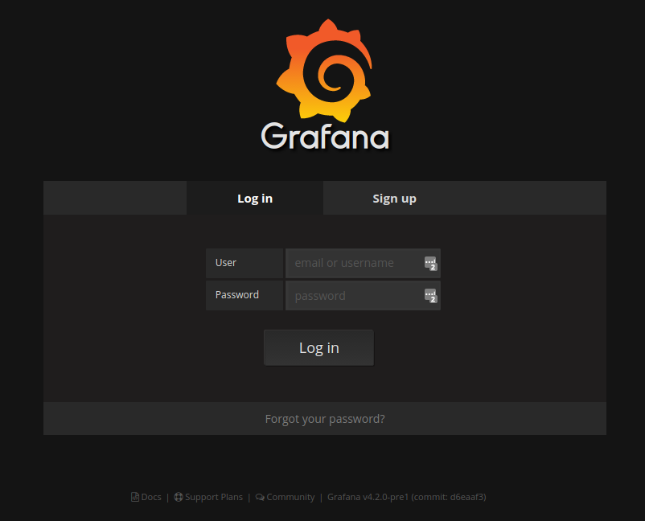

## Skydive for OCP and Grafana with skydive DataSource plugin

Use the following instructions to deploy the full stack, Skydive + Grafana with Skydive plugin. Note that the Skydive Agent is configured to get information from the SDN using ovs-multitenant plugin:

      # oc new-project skydive
      # oc create -f https://raw.githubusercontent.com/makentenza/grafana-skydive/master/kube/skydive-template.json
      # oc adm policy add-scc-to-user privileged system:serviceaccount:skydive:default
      # oc new-app skydive
        --> Deploying template skydive

        --> Creating resources with label app=skydive ...
            service "skydive-analyzer" created
            deploymentconfig "skydive-analyzer" created
            daemonset "skydive-agent" created
            route "skydive-analyzer" created
        --> Success
            Run 'oc status' to view your app.

      In order to deploy all the skydive agents across your Nodes, label them accordingly:

      # oc label nodes --all skydive=true

As soon as the agent Pods are running, you will see all your Cluster topology in your Skydive Analyzer wen interface.

Once the Skydive part is deployed we can now deploy the Grafana part:

      # oc create -f https://raw.githubusercontent.com/makentenza/grafana-skydive/master/kube/grafana-skydive.json
        imagestream "grafana-skydive" created
        serviceaccount "grafana" created
        buildconfig "grafana-skydive" created
        service "grafana" created
        deploymentconfig "grafana-skydive" created
      # oc adm policy add-scc-to-user anyuid system:serviceaccount:skydive:grafana

This will build your Grafana image with skydive DataSource included and will deploy it. As soon as the Pod is running you will be able to access to Grafana using the created Route. Use the default user and password (admin/admin).

We need first to configure the DataSource to get info from the Skydive Analyzer instance. Select a descriptive name for this Data Source, and use 'Skydive' Type from the dropdown list. You will need to specify the URL of your Skydive Analyzer; you can use the Kubernetes Service DNS name is this will be resolved from your Grafana Pod, and port 8082. Select 'proxy' Access type and 'Save & Test' your Data Source.

G.V().Has('Name', Regex('_openshift-infra_')).Out().Has("Type", "veth")
